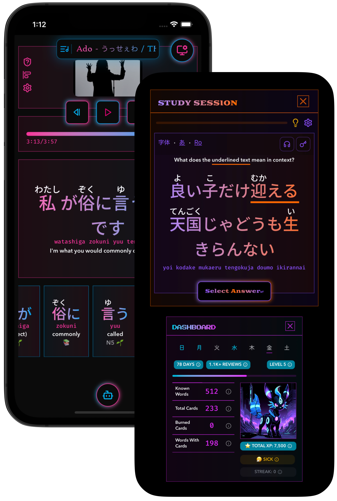
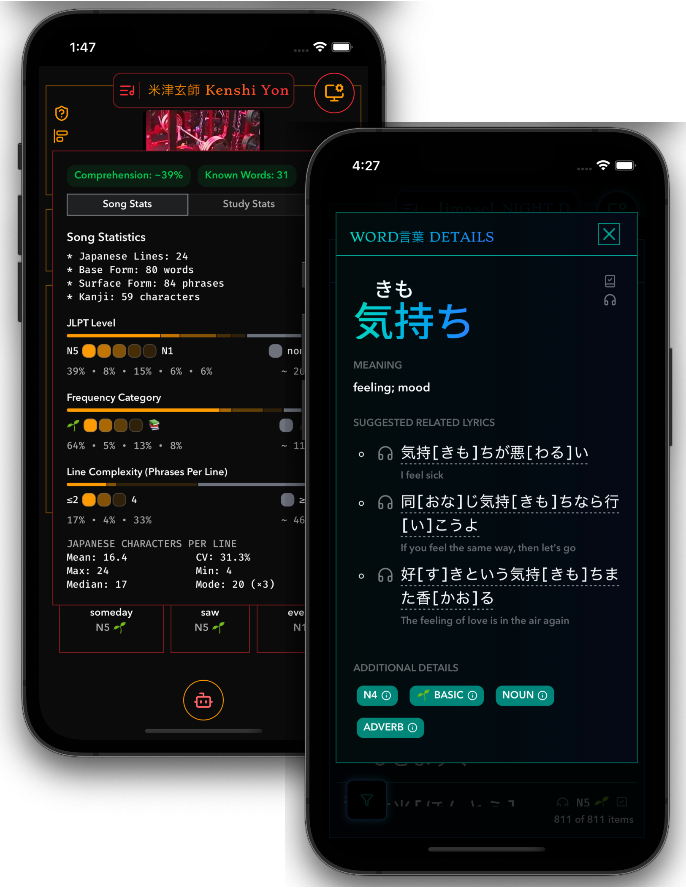
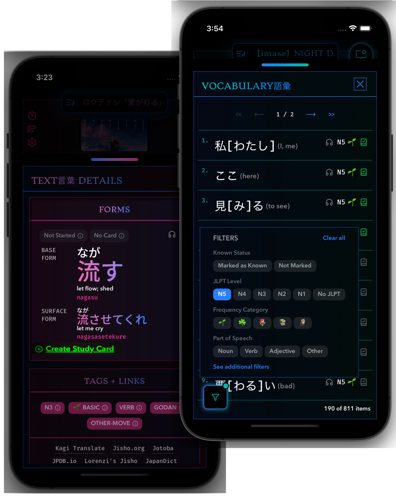
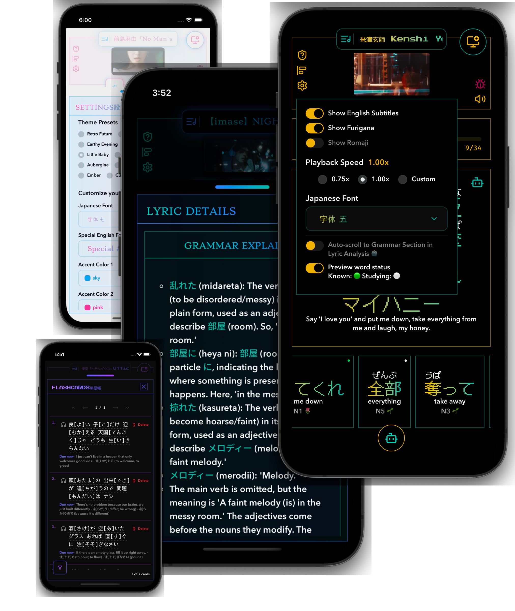

# Already love [Ririkku](https://ririkku.com/)? Go Premium.

Turn Japanese lyrics immersion into measurable growth. Ririkku's Premium features helps you remember more, track real progress, and stay consistent — naturally committing 4,000+ Japanese words to long-term memory.

##  How It Works

### Step 1: Enjoy Immersing in Japanese Lyrics 
- Grammar breakdowns and vocabulary information are just a tap away
- Easily find songs that match your skill level. How?
  - Songs are ordered by difficulty 
  - Song Statistics: JLPT level breakdown, lyric complexity analysis, and more 
  - Comprehension Score: Mark words as known and see how much of a song you truly understand 

 

### Step 2: Capture What You Want to Remember  

- See an interesting line? Turn it into a study card instantly
- Not sure what to focus on? Follow Ririkku's suggest lyrics and learning order based on high-frequency words and grammar patterns. 

 

### Step 3: Stay motivated and study efficiently  

- Ririkku keeps it engaging with game-like features like daily quests, visual progress tracking, and meeting friendly monsters as you level up 
- Ririkku uses the latest research-backed algorithm to schedule reviews at the optimal moment—just before you forget—so every study session focuses on what truly needs reinforcement.

 

### Step 4: Learn Anywhere, anytime
- Replace mindless scrolling with brief study sessions. From bus rides to grocery lines, turn idle moments into progress. 
- Repeat steps 1-3 over and over and before you know it, you've already mastered 4,000+ words!

## Details Matter 
We obsess over the small things. We put a lot of thought and care into designing a happy experience for you. Because when learning feels good, you keep coming back.

 

## Ririkku is Perfect For
- 🌱 Complete beginners who want fun immersion
- 🧗 Learners stuck in the intermediate plateau
- 📚 Self-learners who hate textbooks
- 📝 JLPT takers who want real-world exposure
- 🎧 Anime & J-Pop fans who want to understand what they love

## Join the Waitlist 
- Message us on [discord](https://discord.gg/Ash8ZrGb4s). We'll send you an early bird discount code if we launch —otherwise, we won’t bother you. 🤐😁. Limited slots only.
